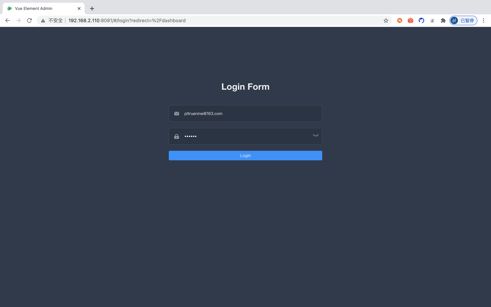
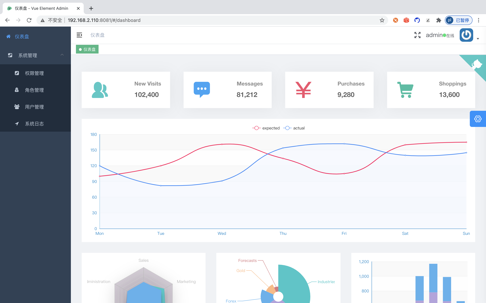
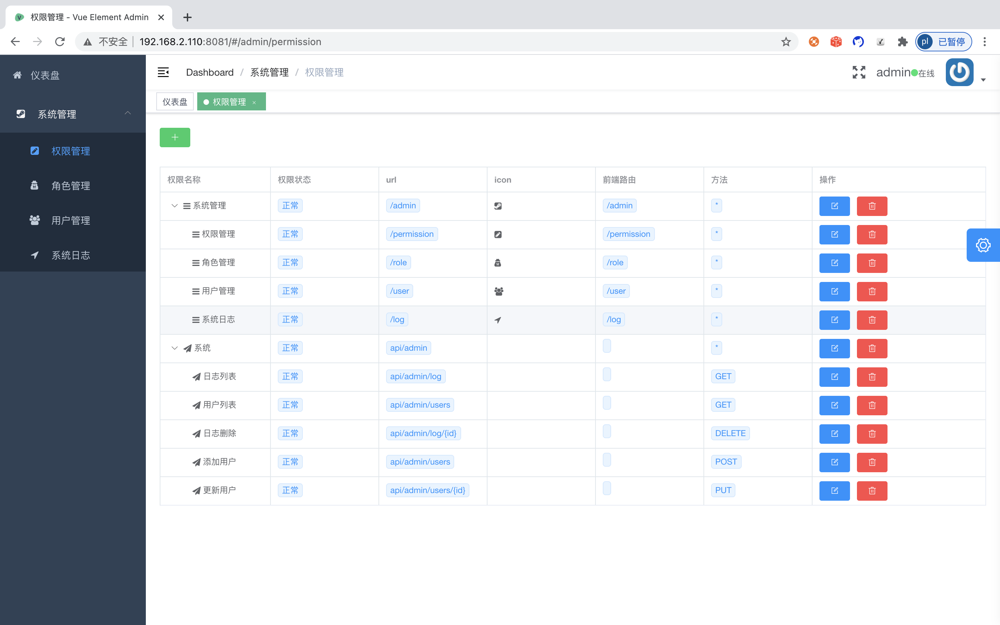
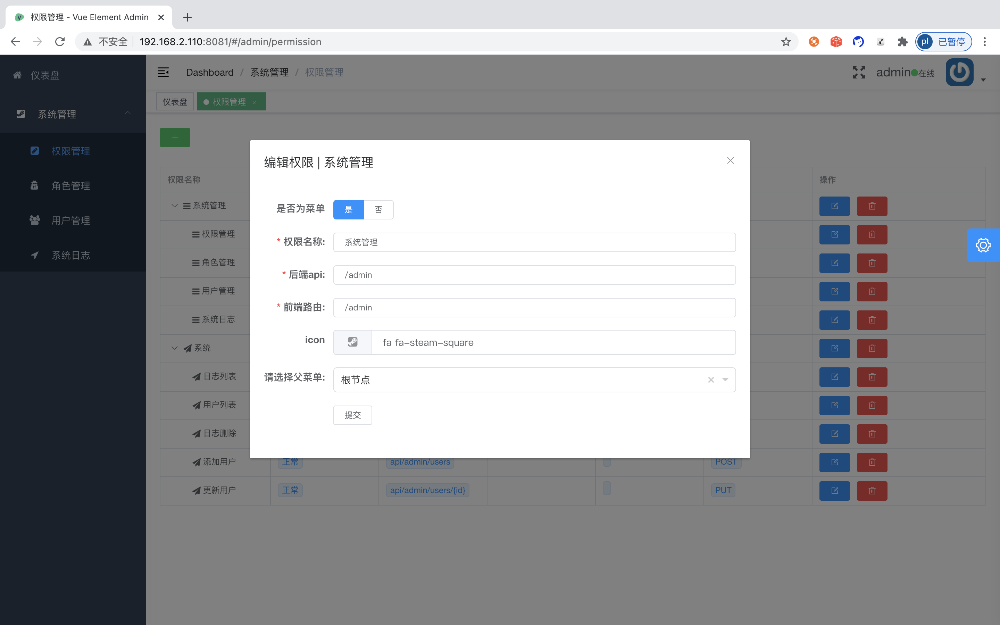
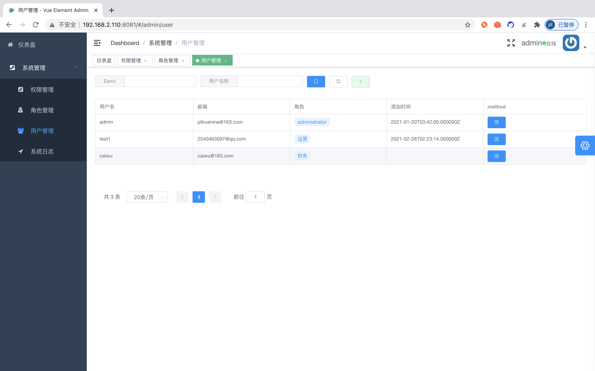
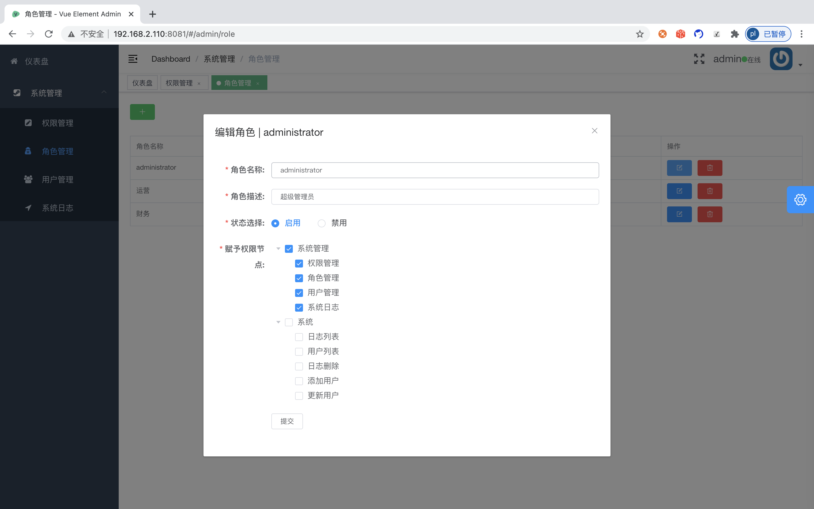
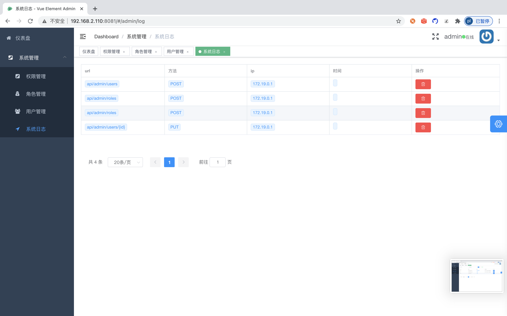

## vue-element-admin + laravel + jwt + casbin 前后端分离 rbac鉴权权限 管理系统
  #### 使用了一下技术

   * [vue-element-admin-是一个后台前端解决方案，它基于 vue 和 element-ui实现](https://panjiachen.github.io/vue-element-admin-site/zh/)
   * [laravel-是一套简洁、优雅的PHP Web开发框架](https://laravel.com/)
   * [casbin-跨平台的访问控制框架](https://github.com/php-casbin/laravel-authz)

   #### 后台界面登录

